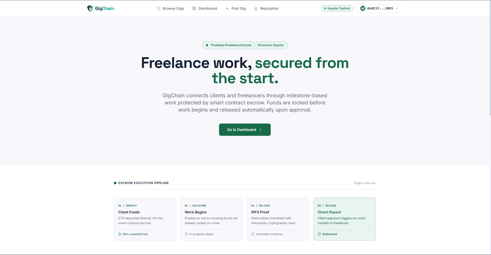
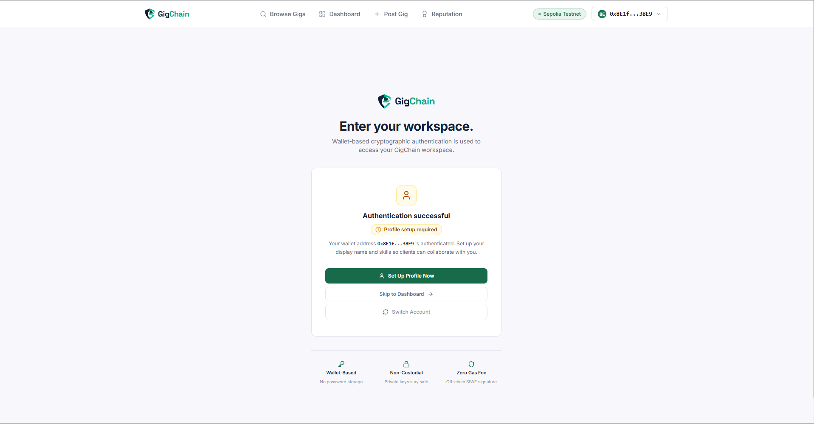
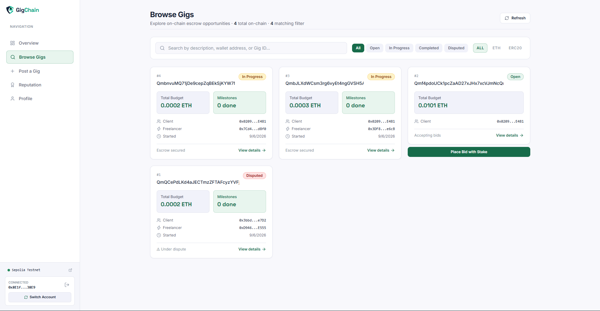
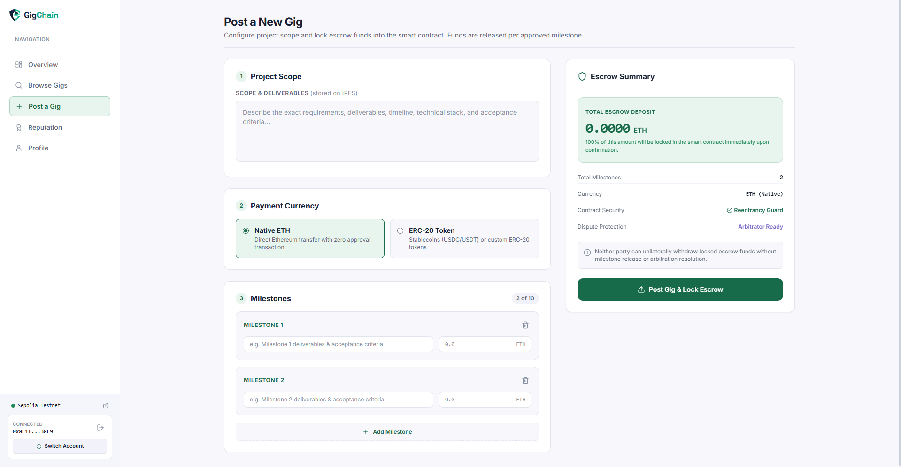
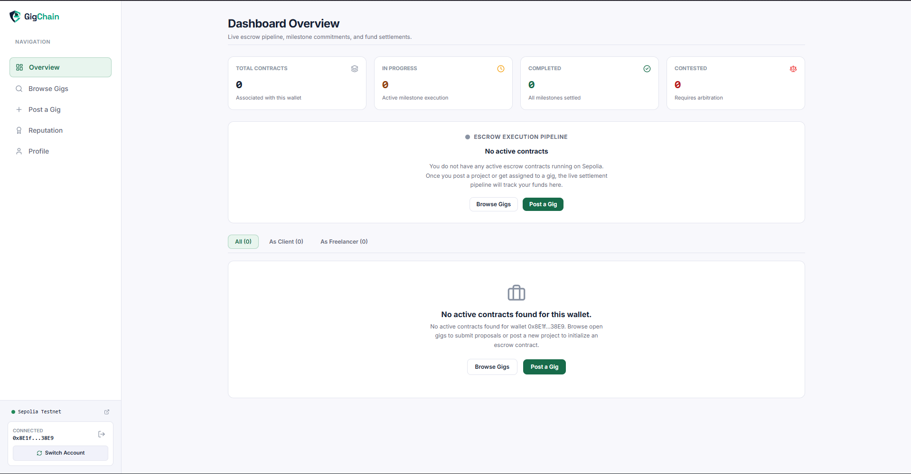
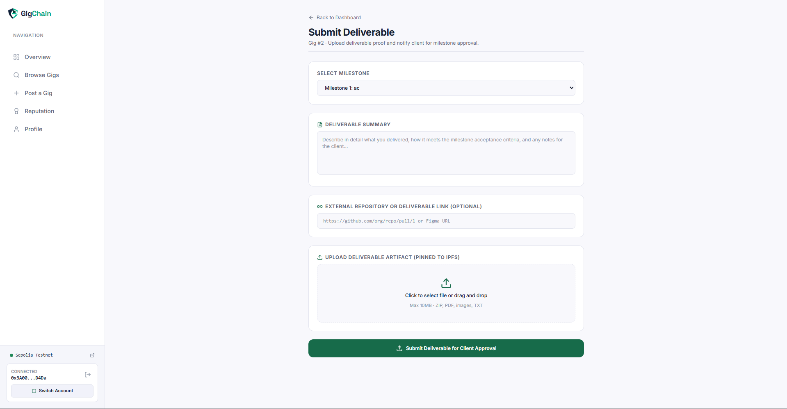
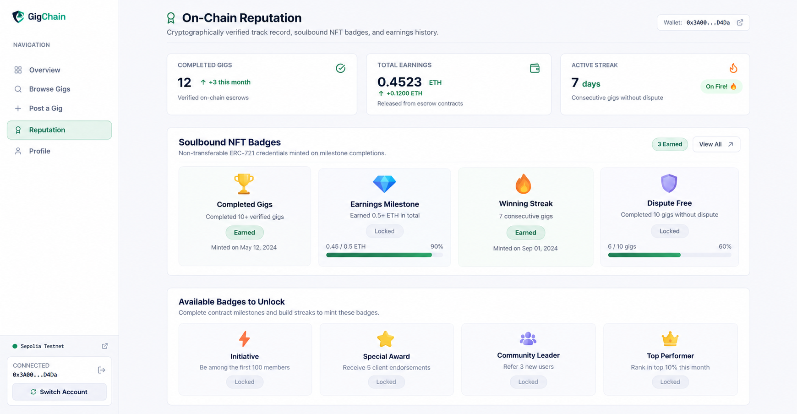
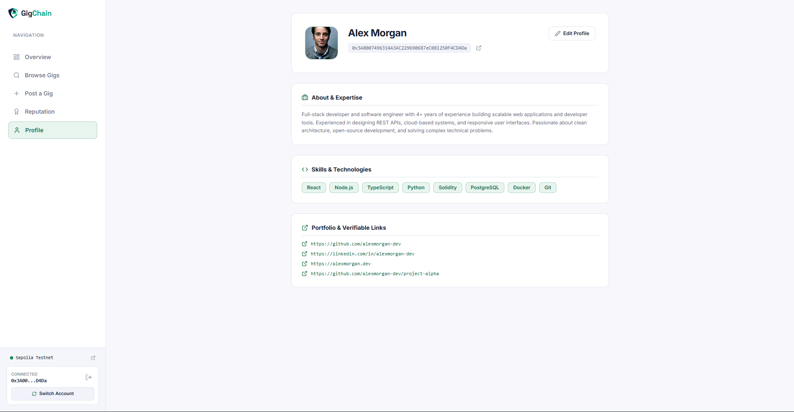

<div align="center">


# GigChain

### Trustless Freelance Escrow on Ethereum

**Smart contract-enforced milestone payments · On-chain NFT reputation · AI-assisted dispute resolution**

No middleman. No fees. No trust required.

[](https://gig-chain.pages.dev/)
[](https://sepolia.etherscan.io/)
[](https://soliditylang.org/)
[](https://vitejs.dev/)
[](LICENSE)

</div>

---

## 🌐 Live Demo

| Resource | Link |
|---|---|
| 🚀 **Live Application** | [https://gig-chain.pages.dev/](https://gig-chain.pages.dev/) |
| 📜 **GigEscrow Contract** | [`0xC07300898FEc59eCCABf81B508d6729B58DaF058`](https://sepolia.etherscan.io/address/0xC07300898FEc59eCCABf81B508d6729B58DaF058) |
| 🏅 **ReputationBadge Contract** | [`0x19b35F036472D8b8D6751D48449Eb5002191beDc`](https://sepolia.etherscan.io/address/0x19b35F036472D8b8D6751D48449Eb5002191beDc) |
| ⛓️ **Network** | Ethereum Sepolia Testnet (Chain ID: `11155111`) |
| 📦 **Deployed** | 2026-09-05 UTC |

> **To try it:** Install [MetaMask](https://metamask.io/), switch to **Sepolia Testnet**, and grab test ETH from [sepoliafaucet.com](https://sepoliafaucet.com/).

---

## 🎯 The Problem

Upwork and Fiverr are **banks that also act as judges.** They:

- Hold your money in custody
- Take **5–20% in fees** on every transaction
- Make final dispute decisions with **zero transparency**
- Can delete your job history and reputation at will

The result? Freelancers lose up to a fifth of their earnings. Clients have no guarantee work will be delivered. Both parties are at the mercy of a single platform.

---

## ✅ The Solution — GigChain

GigChain replaces the centralized platform with a **Solidity smart contract** living on Ethereum. Code is the escrow agent. Code is the dispute engine. Code enforces payment rules.

| Pain Point | Web2 Cause | Web3 Fix |
|---|---|---|
| Platform takes 5–20% fee | Centralized payment processor | Peer-to-peer ETH/ERC-20 via smart contract |
| Funds held by third party | Company custody | Self-custody — only released on condition |
| Opaque dispute resolution | Company employee as arbiter | On-chain arbitrator + AI analysis + full transparency |
| No milestone granularity | All-or-nothing payout | Per-milestone independent lockup and release |
| No verifiable reputation | Proprietary star ratings | On-chain NFT badges tied to objective gig data |
| Platform can erase history | Centralized database | IPFS + on-chain — permanent, immutable records |

---

## 📸 Screenshots

> Add your screenshots to `docs/screenshots/` and the images will appear here.

### 🏠 Landing Page


### 🔐 Connect Wallet (SIWE Auth)


### 📋 Browse Gig Marketplace


### ✏️ Post a Gig (Client Flow)


### 📊 My Contracts Dashboard


### 📤 Submit Work (Freelancer Flow)


### ⚖️ Dispute Resolution


### 🏅 NFT Reputation Badges


### 👤 Profile Page


---

## 🏗️ Architecture Overview

```
┌─────────────────────────────────────────────────────────────────┐
│                         CLIENT BROWSER                          │
│  React + Vite + TypeScript                                      │
│  ┌──────────────┐  ┌──────────────┐  ┌──────────────────────┐  │
│  │  MetaMask    │  │  Ethers.js   │  │   React Context      │  │
│  │  Wallet      │  │  (on-chain   │  │   (Wallet State)     │  │
│  └──────────────┘  │   reads/tx)  │  └──────────────────────┘  │
│                    └──────────────┘                             │
└────────────────────────┬────────────────────┬───────────────────┘
                         │ REST API            │ Blockchain RPC
                         ▼                     ▼
         ┌──────────────────────┐   ┌────────────────────────────┐
         │  Node.js + Express   │   │   Sepolia Testnet (EVM)    │
         │  Backend API         │   │                            │
         │  ┌────────────────┐  │   │  ┌──────────────────────┐  │
         │  │  Supabase      │  │   │  │   GigEscrow.sol      │  │
         │  │  (PostgreSQL)  │  │   │  │   (core contract)    │  │
         │  └────────────────┘  │   │  └──────────────────────┘  │
         │  ┌────────────────┐  │   │  ┌──────────────────────┐  │
         │  │  GPT-4o AI     │  │   │  │ ReputationBadge.sol  │  │
         │  │  Dispute Anal. │  │   │  │ (ERC-721 NFT badges) │  │
         │  └────────────────┘  │   │  └──────────────────────┘  │
         │  ┌────────────────┐  │   └────────────────────────────┘
         │  │  IPFS (Pinata) │  │
         │  └────────────────┘  │
         └──────────────────────┘
```

---

## ✨ Key Features

### ⛓️ Trustless Milestone Escrow
- ETH and any ERC-20 token (USDC, DAI, etc.) locked in smart contract on gig creation
- Client releases each milestone independently — no all-or-nothing payout
- Funds **never** accessible to us — only contract logic controls them
- Even if backend goes down, funds remain safe and claimable on-chain

### 🏅 On-Chain NFT Reputation (ERC-721)
Six evolving badge types, each with 5 upgrade levels:

| Badge | Trigger | Levels |
|---|---|---|
| `COMPLETED_GIGS` | Final milestone release | 5 / 15 / 30 / 50 / 100 gigs |
| `EARNINGS_MILESTONE` | Cumulative earnings | 1 / 5 / 10 / 25 / 50 ETH |
| `STREAK` | Consecutive completions | 3 / 5 / 10 / 15 / 20 streak |
| `DISPUTE_FREE` | No disputes in career | 5 / 15 / 25 / 40 / 60 clean gigs |
| `INITIATIVE` | First wallet connect / bid | Participation badge |
| `SPECIAL` | Granted by arbitrator | Exceptional work |

Badges **evolve in-place** — same NFT tokenId gets upgraded metadata. No new token minted, your badge gets better.

### ⚖️ AI-Assisted Dispute Resolution
```
Dispute Raised
    ↓
GPT-4o analyzes: dispute reason + submission text + evidence
    ↓
AI returns structured recommendation (non-binding):
    {
      "recommendation": "release_to_freelancer",
      "confidence": 0.87,
      "reasoning": "Freelancer provided complete deliverables..."
    }
    ↓
Human arbitrator reviews + makes final on-chain decision
    ↓
Contract pays out — result stored permanently on-chain
```

### 🔐 Sign-In with Ethereum (SIWE)
- No passwords. No email. Prove wallet ownership with a cryptographic signature.
- Backend issues a JWT tied to your wallet address.
- Fully compatible with EIP-4361 standard.

### 📦 IPFS-Anchored Job Records
- Gig descriptions and deliverables pinned to **Pinata (IPFS)**
- IPFS CID stored on-chain — immutable, verifiable, permanent
- No platform can ever edit or delete a job spec

### 💸 Zero Platform Fees
- Only gas costs — no 5–20% cut
- ETH and any ERC-20 stablecoin supported
- Stake-gated bidding prevents spam

---

## ⛓️ Smart Contract Details

### `GigEscrow.sol` — Core Escrow Engine

**Deployed:** [`0xC07300898FEc59eCCABf81B508d6729B58DaF058`](https://sepolia.etherscan.io/address/0xC07300898FEc59eCCABf81B508d6729B58DaF058)

#### State Machine
Every gig follows a strict state machine — no funds can move outside valid transitions:
```
Open → InProgress → Completed
                  ↘ Disputed → (Arbitrator resolves) → Completed / CancelledByClient
     ↘ CancelledByClient
     ↘ CancelledByFreelancer
```

#### Core Functions
| Step | Function | Who Calls | What Happens |
|---|---|---|---|
| 1 | `postGig()` | Client | Locks ETH/ERC-20 in contract, state = `Open` |
| 2 | `bidGig()` | Freelancer | Stakes tokens as commitment, anti-spam |
| 3 | `selectFreelancer()` | Client | Picks winning bid, state = `InProgress` |
| 4 | `releaseMilestonePayment()` | Client | Pays freelancer per milestone independently |
| 5 | `raiseDispute()` | Either | Freezes gig, state = `Disputed` |
| 6 | `submitDisputeResolution()` | Arbitrator | On-chain resolution, pays one party |

#### Security
| Risk | Mitigation |
|---|---|
| Re-entrancy attack | `ReentrancyGuard` on all payment functions |
| Integer overflow | Solidity 0.8.x built-in overflow checks |
| Token approval griefing | `SafeERC20` handles non-standard tokens |
| Gasless transactions | `ERC-2771` meta-transaction support |
| Stuck funds | `cancelGigByClient` recovers unspent milestones |
| Arbitrator centralization | Address upgradeable to multisig/DAO |

### `ReputationBadge.sol` — ERC-721 NFT Reputation

**Deployed:** [`0x19b35F036472D8b8D6751D48449Eb5002191beDc`](https://sepolia.etherscan.io/address/0x19b35F036472D8b8D6751D48449Eb5002191beDc)

- ERC-721 with in-place upgrade mechanism — same tokenId, better metadata
- Only callable by the wired `GigEscrow` contract — no external minting
- Badge levels verifiable on-chain via `hasMinLevel(address, BadgeType, level)`
- Future protocols can gate access using badge level checks

---

## 🔑 GigChain vs. Competitors

| Feature | Upwork / Fiverr | GigChain |
|---|---|---|
| **Fund custody** | Platform holds funds | Smart contract — self-custody |
| **Platform fee** | 5–20% | **0%** (only gas) |
| **Dispute arbitration** | Company employee | Transparent arbitrator + GPT-4o AI |
| **Reputation system** | Proprietary star rating | **On-chain NFT badges** — verifiable by anyone |
| **Payment options** | Fiat / PayPal | ETH + any ERC-20 stablecoin |
| **Job records** | Platform can delete | IPFS + on-chain — **permanent** |
| **Reputation portability** | Locked to platform | **Wallet-portable** — yours forever |
| **Gasless transactions** | N/A | ERC-2771 meta-transactions |

---

## 🛠️ Tech Stack

| Layer | Technology | Why |
|---|---|---|
| **Smart Contracts** | Solidity 0.8.20 + Hardhat | Industry standard, excellent testing tooling |
| **Contract Libraries** | OpenZeppelin 5.x | Battle-tested, audited security primitives |
| **Blockchain** | Ethereum Sepolia Testnet | Full EVM compatibility, free test ETH |
| **Frontend** | React + Vite + TypeScript | Fast DX, type safety, SPA routing |
| **Web3 Library** | Ethers.js v6 | Mature, well-documented, compact bundle |
| **Wallet** | MetaMask (EIP-1193) | Most widely adopted browser wallet |
| **Styling** | Tailwind CSS + shadcn/ui | Rapid UI dev, accessible components |
| **Backend** | Node.js + Express | Familiar JS stack, easy REST APIs |
| **Database** | PostgreSQL via Supabase | Relational integrity, managed hosting |
| **File Storage** | IPFS via Pinata | Permanent, content-addressed storage |
| **AI** | OpenAI GPT-4o | Dispute evidence analysis |
| **Auth** | SIWE (EIP-4361) + JWT | Passwordless, wallet-native authentication |

---

## 📂 Project Structure

```
Hackblox/
├── contracts/                   ← Hardhat — Solidity smart contracts
│   ├── contracts/
│   │   ├── GigEscrow.sol        Core escrow with state machine
│   │   └── ReputationBadge.sol  ERC-721 NFT reputation system
│   ├── scripts/deploy.js        Auto-deploys + wires both contracts
│   ├── test/GigEscrow.test.js   Full test suite
│   └── hardhat.config.cjs
│
├── backend/                     ← Node.js + Express API
│   ├── routes/
│   │   ├── authRoutes.js        SIWE + JWT auth
│   │   ├── profileRoutes.js     Off-chain freelancer profiles
│   │   ├── gigRoutes.js         Gig metadata + search
│   │   ├── submissionRoutes.js  Work submissions + evidence
│   │   ├── disputeRoutes.js     Dispute ticket management
│   │   ├── aiRoutes.js          GPT-4o dispute analysis
│   │   └── analyticsRoutes.js   Platform stats + leaderboard
│   ├── middleware/auth.js        JWT verification middleware
│   ├── lib/supabase.js           Supabase client
│   ├── lib/pinata.js             IPFS pinning
│   ├── lib/ai.js                 OpenAI integration
│   └── supabase-schema.sql       Full DB schema
│
└── frontend/                    ← Vite + React + TypeScript
    └── src/
        ├── pages/               Welcome, Auth, PostGig, Browse, Dashboard...
        ├── components/          Navbar, MilestoneCard, BadgeCard...
        ├── context/             WalletContext (MetaMask state)
        ├── hooks/               useContract, useGig
        ├── abi/                 GigEscrow.json, ReputationBadge.json
        └── lib/                 types, api client, contract addresses
```

---

## 🚀 Local Development Setup

### Prerequisites
- **Node.js 18+**
- **MetaMask** browser extension
- Git

### 1. Clone the repository
```bash
git clone https://github.com/Aanish-py/Hackblox.git
cd Hackblox
```

### 2. Install dependencies (all three layers)
```bash
cd contracts && npm install
cd ../backend && npm install
cd ../frontend && npm install
```

### 3. Configure environment variables

**`backend/.env`**
```env
SUPABASE_URL=your_supabase_project_url
SUPABASE_ANON_KEY=your_supabase_anon_key
JWT_SECRET=your_jwt_secret_here
PINATA_JWT=your_pinata_jwt_token
OPENAI_API_KEY=sk-proj-...        # Optional: enables AI dispute analysis
FRONTEND_URL=http://localhost:5173
```

**`frontend/.env`**
```env
VITE_BACKEND_URL=http://localhost:4000
```

### 4. Set up Supabase database
Open your Supabase SQL Editor → **New Query** → paste `backend/supabase-schema.sql` → **Run**.

### 5. Run contracts on local Hardhat node
```bash
cd contracts
npx hardhat node                   # Spin up local EVM
npx hardhat run scripts/deploy.js  # Deploy contracts locally
```
This auto-saves deployed addresses to `frontend/src/lib/addresses.json`.

### 6. Start the backend
```bash
cd backend
npm start
# Backend runs on http://localhost:4000
```

### 7. Start the frontend
```bash
cd frontend
npm run dev
# Frontend runs on http://localhost:5173
```

### 8. Configure MetaMask for local development
- Network: **Localhost 8545**, Chain ID: `31337`
- Import a Hardhat test account using private keys printed by `npx hardhat node`

---

## 🌐 Deploy to Sepolia Testnet

> **Contracts already deployed!** See [Live Demo](#-live-demo) for addresses.

To redeploy:

```bash
# 1. Add to contracts/.env:
SEPOLIA_RPC_URL=https://eth-sepolia.g.alchemy.com/v2/YOUR_KEY
PRIVATE_KEY=0xYourPrivateKeyHere

# 2. Deploy
cd contracts
npx hardhat run scripts/deploy.js --network sepolia

# Deployment order (auto-handled by deploy.js):
# → Deploy ReputationBadge
# → Deploy GigEscrow
# → Wire: ReputationBadge.setGigEscrowAddress(escrowAddr)
# → Wire: GigEscrow.setReputationBadgeContract(badgeAddr)
# → GigEscrow.toggleBadges(true)
# → Saves addresses to frontend/src/lib/addresses.json
```

---

## 📖 Detailed Technical Report


For a full technical deep-dive including contract specs, security analysis, gas optimization, and architectural decisions, see [`solution.md`](solution.md).

---

## 📜 License

MIT — see [LICENSE](LICENSE) for details.

---

<div align="center">

**Built for Hackblox Hackathon 2026**

*GigChain — Because code is a better judge than a company.*

[](https://gig-chain.pages.dev/)

</div>
